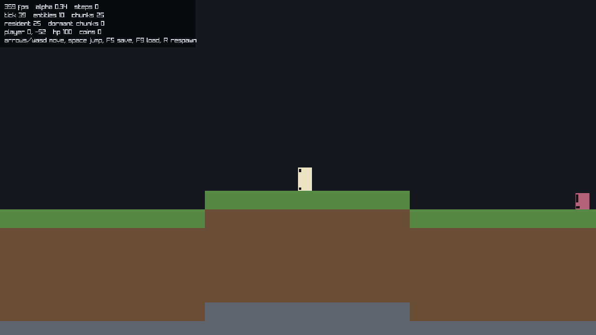

# osai

A 2D data-oriented ECS engine in [Odin](https://odin-lang.org), on raylib.

The design lives in [docs/SPEC.md](docs/SPEC.md) and is the authority; this
README says what exists, what does not, and where to look. If the code and the
spec disagree, that is a bug in one of them — say which.

## Build and run

Needs the Odin compiler (raylib ships with it, under `vendor:raylib`).

```
make build      # odin build src -out:bin/osai -vet
make run        # windowed
make headless   # runs the simulation with no window at all
make test       # odin test tests
make check      # type-check every package
```

Controls: arrows/WASD move, space jumps, F5 saves, F9 loads, R respawns.



There is no art: entities draw as tinted boxes with a small marker showing the
current animation frame and facing. `--frames=N --screenshot=PATH` runs a fixed
number of frames and quits, which is enough of a smoke test to catch a renderer
that no longer starts.

`--headless` matters more than it looks: it runs the same fixed step with
scripted intent and prints the resulting state. `sim` does not import raylib,
so the simulation genuinely does not need a window, and a seed plus a tick
count fully describes a run:

```
./bin/osai --headless --ticks=3000 --seed=1441
```

## Layout

One directory per Odin package. The import graph is a DAG and that is
load-bearing, not tidiness:

```
src/ecs      entity slots, generations, free list, generic sparse set
src/world    tiles, chunks, seeded generation      (imports nothing)
src/sim      components, systems, queues, streaming, persistence
src/render   interpolation, drawing, debug overlay (imports sim)
src/         package main: window, input, the frame loop
tests/       odin test
```

`sim` does not import `render`. That is the spec's *"`render_position` is
display-only, the simulation must never read it"* turned into something the
compiler enforces: the interpolated position lives in `render.Renderer`, so no
system can reach it even by accident.

`world` imports nothing at all, which is why generation can be a pure function
of `(seed, coordinate)` — see below.

## What the frame does

The numbering matches the spec.

| # | Step | Where |
|---|------|-------|
| 0 | Streaming (residency) | `sim/streaming.odin` |
| 1 | Input → `intent` | `src/input.odin` |
| 2 | AI → `intent` | `sim/systems_control.odin` |
| 3 | Movement → `velocity` | `sim/systems_control.odin` |
| 4 | Integration → `position` | `sim/systems_control.odin` |
| 5 | Collision → `grounded`, queues | `sim/systems_collision.odin` |
| 6 | Drain damage, pickups, spawns | `sim/drains.odin` |
| 7 | Consequences (death) | `sim/systems_status.odin` |
| 8 | Animation → `sprite` | `sim/animation.odin` |
| 9 | Interpolation → `render_position` | `render/render.odin` |
| 10 | Rendering | `render/render.odin` |

Steps 2–7 run inside `sim.fixed_step`; `sim.advance` runs it as many times as
the accumulator owes, capped, and returns the leftover fraction for step 9.

The step itself is data: `sim.SCHEDULE` in `sim/step.odin` is the ordered list
of `{name, proc}`, and `fixed_step` walks it. So does the profiler, which is
the point — it used to keep a hand-written copy of the order and could drift
from it. Adding a system is one row, and it is profiled from the moment it is
added.

Entity-vs-entity collision goes through a broadphase grid (`sim/broadphase.odin`),
rebuilt each step into one hashed cell table that every interaction pass
queries. It is not the naive product of two arrays.

## Things worth knowing before reading the code

**Absence is the declaration.** A coin has position, collider, appearance and
an item slot. It has no `health`, so nothing can damage it; no
`movement_params`, so gravity never touches it. Neither fact is written down
anywhere — the coin is just not in those arrays. `absence_of_health_means_invulnerable`
in `tests/sim_test.odin` is that rule as a test.

**Systems never call each other.** The damage drain does not animate anything;
it writes a *commanded* animation ID and a priority into the animation state
and moves on. The animation system decides whether that command outranks what
it would derive from velocity. See `damage_writes_an_animation_command_without_calling_animation`.

**Streaming is residency.** An entity that leaves the active region is copied
out of the component arrays and removed. Its *slot* is not freed, so handles to
it stay valid and it comes back identical, in the same chunk, with the same
handle. Systems never filter: everything in the arrays is active by definition.

**Generation is a pure function of `(seed, coord)`,** not a stateful RNG
stream. That is what makes chunks generate the same way regardless of the order
the player wanders into them — `generation_is_seeded_and_order_independent`
checks exactly that. Population is separate and runs once per chunk ever, or
walking away and back would duplicate every creature.

**A seed and a tick count really do describe a run.** They did not until
recently: several passes iterated a `map`, and Odin seeds a map's hash from the
address its data was allocated at, so chunk order — and with it the order
entity slots are handed out — varied between runs of the same binary.
`a_seed_and_a_tick_count_fully_describe_a_run` in `tests/sim_test.odin` holds
two states alive at once, which is what makes their maps land at different
addresses, and checks they agree.

**Saving is writing the arrays out**, because they were already flat. The
round-trip test restores a run and then steps both copies 60 more times and
compares positions.

## Not built yet

Named because "not built" and "overlooked" should not look the same:

- **Terrain is drawn one quad per tile**, not as batched chunk meshes.
- **No art and no audio.** `texture_table` exists and is empty; entities draw
  as tinted boxes with a marker showing the current animation frame and
  facing, so the animation system is visible without a single png. Sound
  requests are appended and then dropped by the presentation layer.
- **Dirty chunks are kept in memory on unload**, not written to disk. Saving
  writes them; unloading does not yet.
- **No offline progress.** The spec's timestamp-on-reload approach is not
  implemented because nothing yet grows.
- **`ai_state` has two behaviours** (idle, patrol) and `Spawn_Kind` has three
  entries. Which creatures exist is deliberately unresolved; these exist to
  give the systems something to move.

## Open questions the code takes a position on

The spec's *next unmade decisions*, and what this code currently does — none of
these are settled:

- **Is `intent` one component or several?** One, for now. Nothing writes it
  from two sources yet, so the fight the spec anticipates has not happened. When
  it does, layered intent with priority is the same shape as the animation
  command resolution already in `animation.odin`.
- **Where does collision correction belong?** Inline in the collision system.
  It is axis-separated and about forty lines; splitting it into a resolution
  pass would currently buy nothing but a second traversal.
- **Projectiles whose target streams out?** No projectiles yet, so no position.

## Learning Odin

If Odin is new to you, [docs/ODIN-NOTES.md](docs/ODIN-NOTES.md) walks through
the language features this codebase leans on, each pointing at the line that
uses it.
